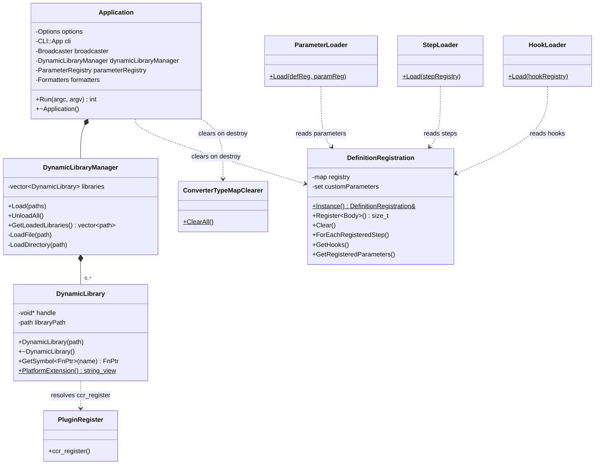
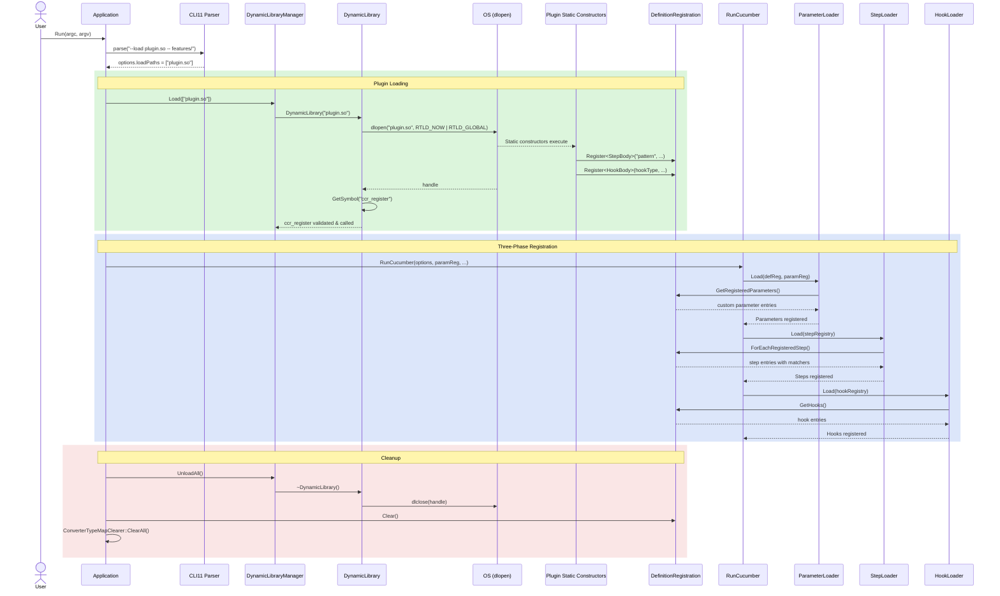
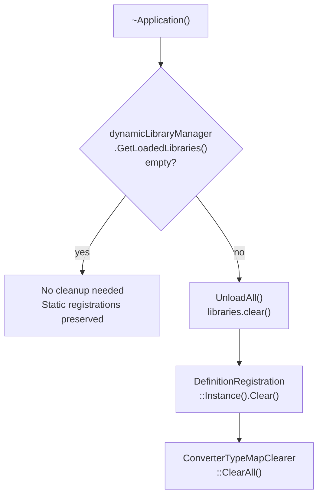

# Plugin Architecture

## Object Diagram



## Data Flow

```mermaid
flowchart TB
    subgraph build["Build Phase"]
        src["Plugin Source\nSTEP / HOOK / PARAMETER macros"]
        reg["ccr_plugin_register\nObject Library"]
        mod["MODULE Library\n.so / .dylib / .dll"]
        src --> mod
        reg --> mod
    end

    subgraph load["Load Phase — Application::Run"]
        cli["Parse --load paths"]
        mgr["DynamicLibraryManager::Load"]
        dir{"Directory\nor File?"}
        scan["Scan & sort by\nplatform extension"]
        open["dlopen / LoadLibrary\nRTLD_NOW | RTLD_GLOBAL"]
        sym["dlsym ccr_register\nValidation gate"]
        call["Invoke ccr_register"]
        static["Plugin static constructors\nalready ran on dlopen"]
        singleton["DefinitionRegistration\nsingleton populated"]

        cli --> mgr --> dir
        dir -->|directory| scan --> open
        dir -->|file| open
        open --> sym --> call
        open -.->|side effect| static --> singleton
    end

    subgraph run["Execution Phase — RunCucumber"]
        p1["Phase 1: ParameterLoader\nCustom parameters → ParameterRegistry"]
        p2["Phase 2: StepLoader\nStep definitions → StepRegistry"]
        p3["Phase 3: HookLoader\nHooks → HookRegistry"]
        exec["Runtime executes\nscenarios"]

        p1 --> p2 --> p3 --> exec
    end

    subgraph cleanup["Cleanup Phase — ~Application"]
        unload["DynamicLibraryManager::UnloadAll\nlibraries.clear → dlclose"]
        clear["DefinitionRegistration::Clear\nregistry + customParameters"]
        clearTypes["ConverterTypeMapClearer::ClearAll"]

        unload --> clear --> clearTypes
    end

    build --> load --> run --> cleanup
```

## Sequence Diagram — Plugin Lifecycle



## Cleanup Guard

The `Application` destructor only clears registrations when plugins were loaded,
preserving statically-linked step definitions between runs:


