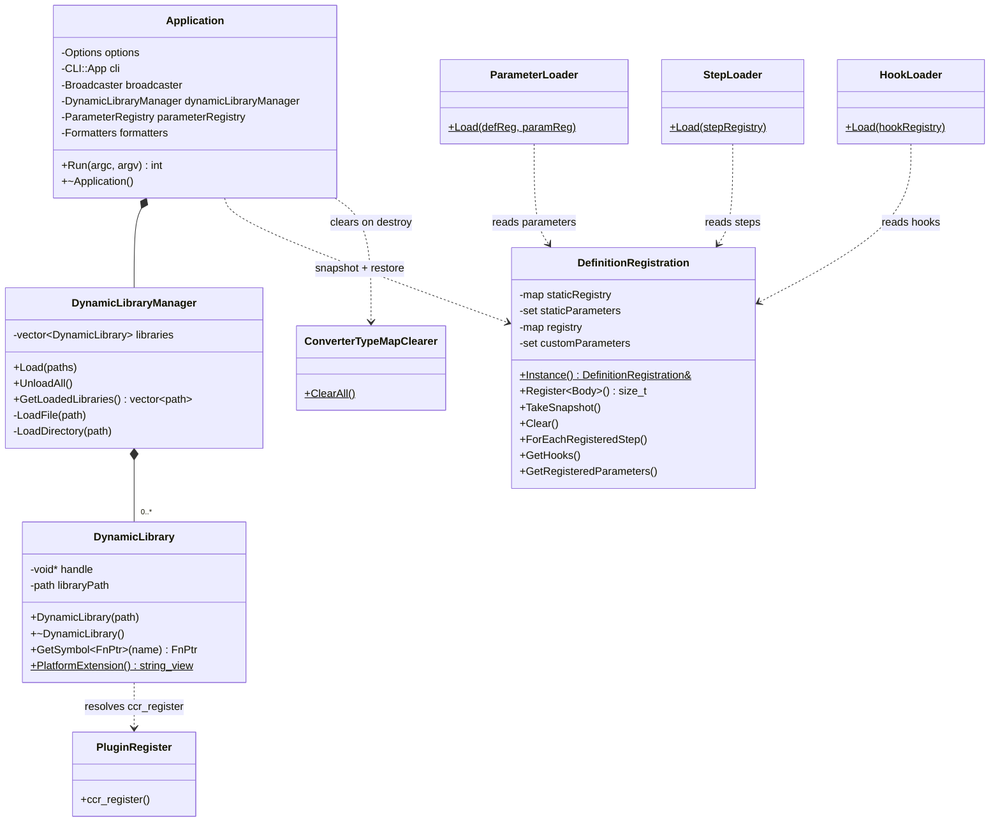
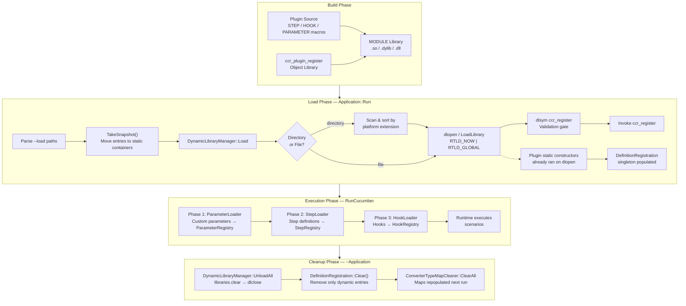
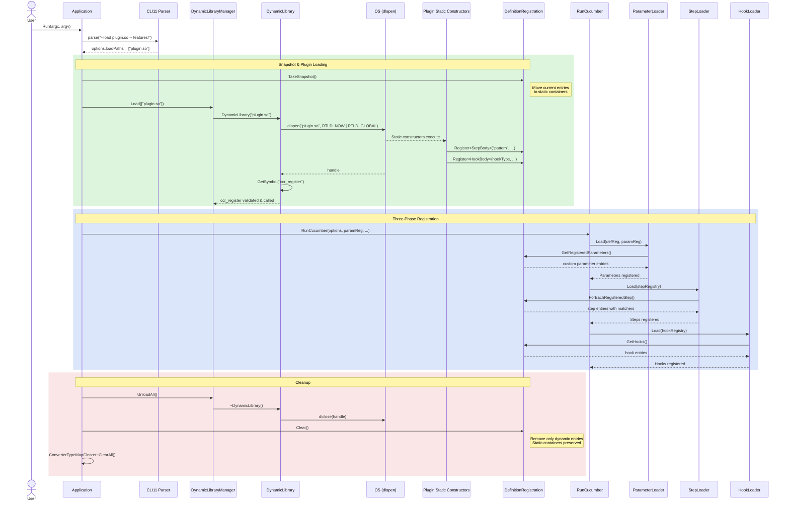
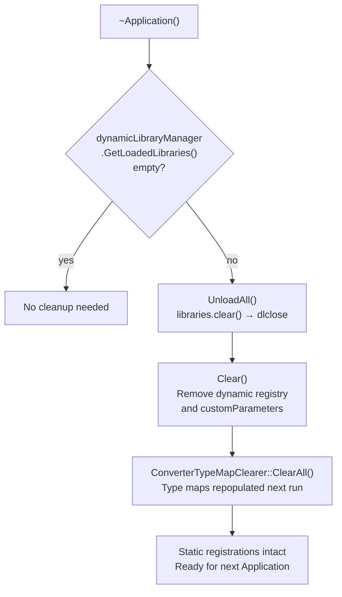

# Plugin Architecture

This document describes the dynamic plugin loading system for cucumber-cpp-runner.
Plugins are shared libraries (`.so` / `.dylib` / `.dll`) that register steps, hooks,
and parameter types at runtime via the same macros used in statically-linked code.

---

## Overview

The plugin system enables loading cucumber step definitions, hooks, and custom
parameter types from shared libraries at runtime via the `--load` CLI option.
This allows test code to be compiled independently of the main runner executable
and loaded on demand.

Key design principles:

- **Transparent authoring** — plugin source files use the same `STEP`, `HOOK_*`,
  and `PARAMETER` macros as statically-linked code.
- **Static registration preserved** — destroying an `Application` only removes
  dynamically-loaded definitions; statically-linked registrations survive.
- **Cross-platform** — works on Linux (`.so`), macOS (`.dylib`), and Windows (`.dll`).
- **Validation** — each plugin must export a `ccr_register` symbol (provided
  automatically by `ccr_add_plugin`) as an entry-point validation gate.

---

## Object Diagram

**`Application`** owns the `DynamicLibraryManager` and orchestrates the full
lifecycle: CLI parsing → snapshot → plugin loading → execution → cleanup.

**`DynamicLibraryManager`** manages plugin lifetime. It holds a vector of
`DynamicLibrary` RAII wrappers. `Load()` accepts file paths or directories;
directories are scanned for platform-matching shared libraries and loaded in
sorted order.

**`DynamicLibrary`** is a move-only RAII wrapper around `dlopen`/`LoadLibrary`.
Construction opens the library; destruction closes it. `GetSymbol<FnPtr>(name)`
resolves a typed function pointer.

**`DefinitionRegistration`** is the global singleton holding all step, hook, and
parameter registrations. Entries are keyed by `std::source_location`. The
dual-container design (`TakeSnapshot` / `Clear`) separates static and
dynamic entries: `TakeSnapshot` moves current entries to dedicated static
containers, and `Clear` only removes the dynamic ones.

---

## Data Flow

The data flow has four phases:

1. **Build** — plugin sources are compiled into MODULE shared libraries. The
   `ccr_add_plugin` CMake function automatically links the `ccr_plugin_register`
   object library which provides the `ccr_register` entry point.

2. **Load** — `Application::Run` parses `--load` paths, takes a registry
   snapshot (capturing the static baseline), then delegates to
   `DynamicLibraryManager`. Each library is opened with `RTLD_NOW | RTLD_GLOBAL`,
   which triggers the plugin's static constructors — these register steps/hooks/
   parameters into the global `DefinitionRegistration` singleton.

3. **Execution** — `RunCucumber` reads from `DefinitionRegistration` in three
   ordered phases: parameters first (so step expressions can reference custom
   types), then steps, then hooks.

4. **Cleanup** — the `Application` destructor unloads plugins (`dlclose`), then
   calls `Clear()` which removes only the dynamic entries (those registered
   after `TakeSnapshot`), preserving statically-linked definitions.

---

## Sequence Diagram — Plugin Lifecycle

---

## Snapshot & Cleanup

The `Application` destructor uses a snapshot-based approach so that statically-
linked step/hook/parameter definitions are never lost — only plugin-injected
entries are removed.

**How it works:**

1. Before plugins are loaded, `TakeSnapshot()` moves the current `registry`
   and `customParameters` into separate `staticRegistry` and `staticParameters`
   containers. This represents the "static baseline" — everything registered
   by code compiled directly into the executable.

2. Plugins load and their static constructors add new entries to the (now
   empty) `registry` and `customParameters` containers.

3. On destruction, `Clear()` clears only the dynamic `registry` and
   `customParameters`. The static containers are untouched.

4. `ConverterTypeMapClearer::ClearAll()` clears all converter type maps. This
   is safe because these maps are repopulated from `DefinitionRegistration`
   contents at the start of each `RunCucumber` call (Phase 1: ParameterLoader).

**Consequence**: Multiple sequential `Application` instances in the same process
will correctly share statically-linked definitions while each getting a fresh
set of plugin-loaded definitions.
