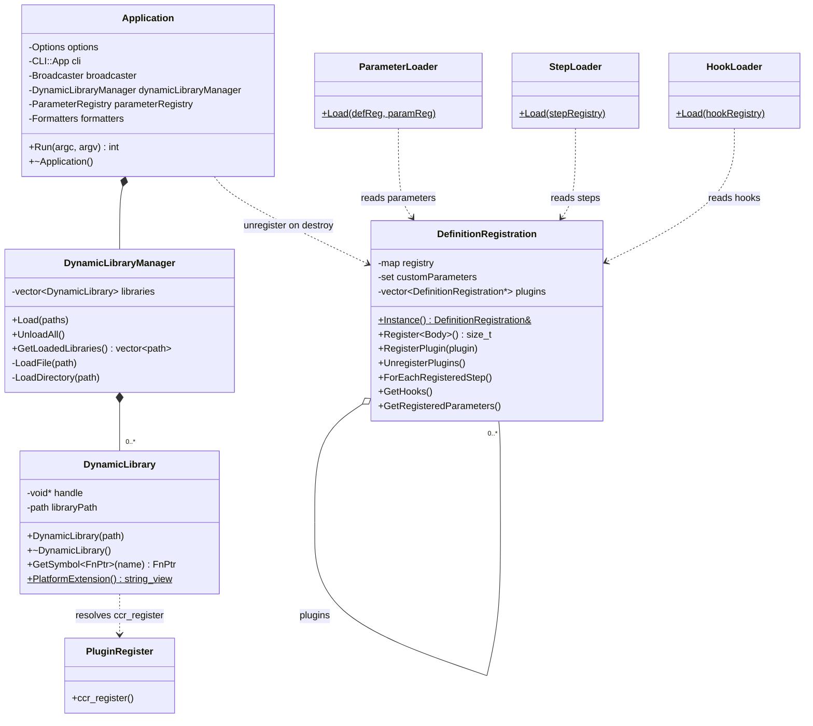
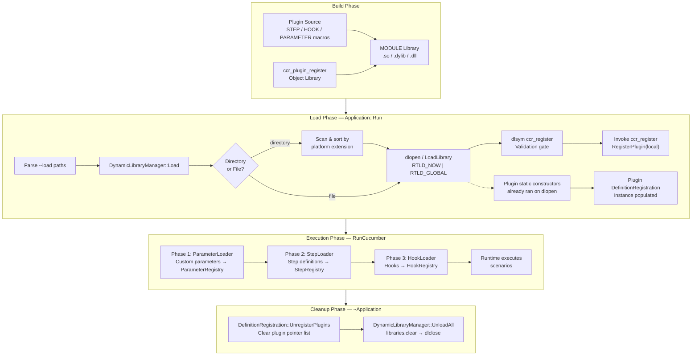
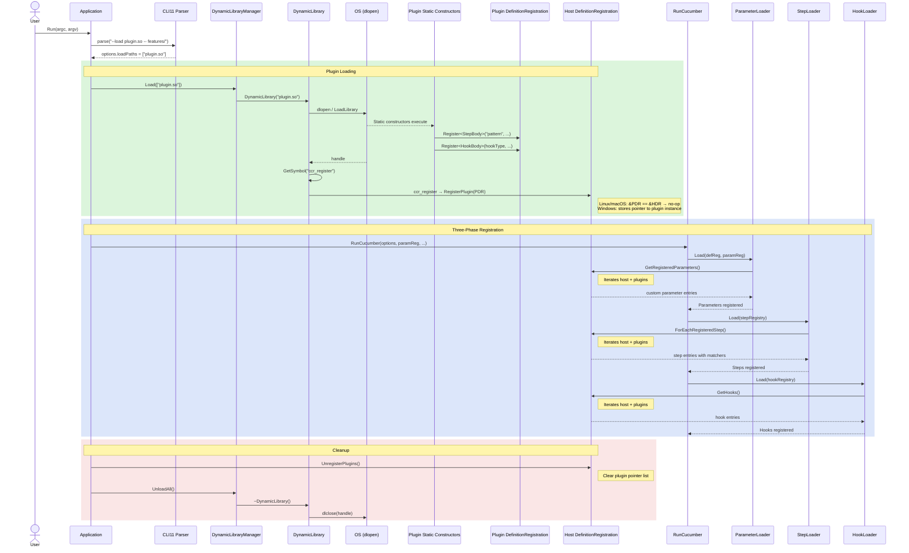
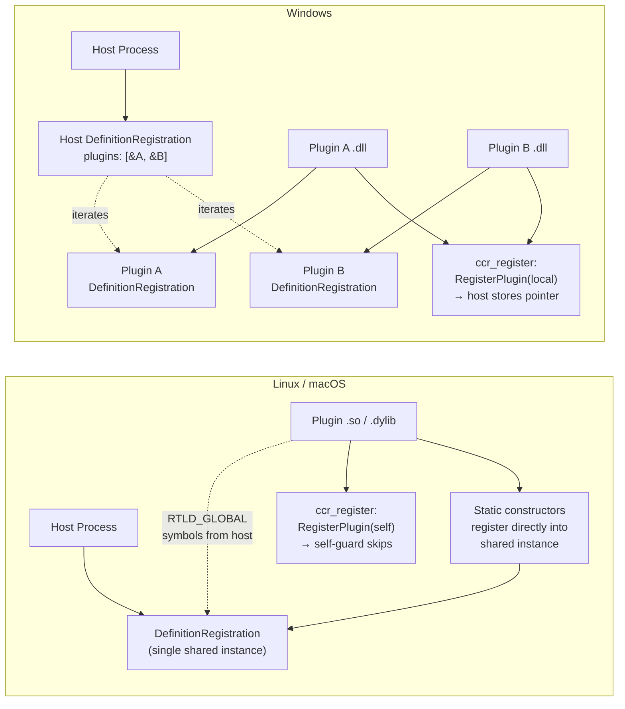
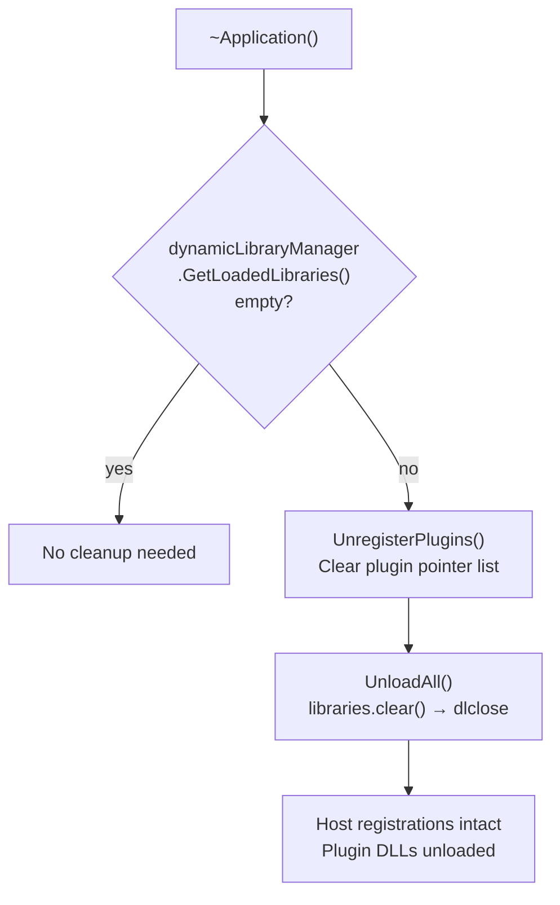

# Plugin Architecture

This document describes the dynamic plugin loading system for cucumber-cpp-runner.
Plugins are shared libraries (`.so` / `.dylib` / `.dll`) that register steps, hooks,
and parameter types at runtime via the same macros used in statically-linked code.

---

## Overview

The plugin system enables loading cucumber step definitions, hooks, and custom
parameter types from shared libraries at runtime via the `--load` CLI option.
This allows test code to be compiled independently of the main runner executable
and loaded on demand.

Key design principles:

- **Transparent authoring** — plugin source files use the same `STEP`, `HOOK_*`,
  and `PARAMETER` macros as statically-linked code.
- **Registrations stay in-place** — each plugin keeps its own
  `DefinitionRegistration` instance; the host holds references and aggregates
  lookups across all plugins.
- **Cross-platform** — works on Linux (`.so`), macOS (`.dylib`), and Windows (`.dll`).
- **Validation** — each plugin must export a `ccr_register` symbol (provided
  automatically by `ccr_add_plugin`) as an entry-point validation gate.

---

## Object Diagram

**`Application`** owns the `DynamicLibraryManager` and orchestrates the full
lifecycle: CLI parsing → plugin loading → execution → cleanup.

**`DynamicLibraryManager`** manages plugin lifetime. It holds a vector of
`DynamicLibrary` RAII wrappers. `Load()` accepts file paths or directories;
directories are scanned for platform-matching shared libraries and loaded in
sorted order.

**`DynamicLibrary`** is a move-only RAII wrapper around `dlopen`/`LoadLibrary`.
Construction opens the library; destruction closes it. `GetSymbol<FnPtr>(name)`
resolves a typed function pointer.

**`DefinitionRegistration`** is a singleton holding step, hook, and parameter
registrations. Entries are keyed by `std::source_location`. Each plugin has its
own instance; the host's instance holds a `plugins` vector of pointers to
plugin instances. Query methods iterate the host's own entries first, then each
plugin's entries.

---

## Data Flow

The data flow has four phases:

1. **Build** — plugin sources are compiled into MODULE shared libraries. The
   `ccr_add_plugin` CMake function automatically links the `ccr_plugin_register`
   object library which provides the `ccr_register` entry point.

2. **Load** — `Application::Run` parses `--load` paths and delegates to
   `DynamicLibraryManager`. Each library is opened (`dlopen` with
   `RTLD_NOW | RTLD_GLOBAL` on Linux/macOS, `LoadLibrary` on Windows),
   which triggers the plugin's static constructors — these register steps/hooks/
   parameters into the plugin's `DefinitionRegistration` instance. Then
   `ccr_register` is called: on Linux/macOS this is a no-op (shared singleton),
   on Windows it registers the plugin's separate instance with the host.

3. **Execution** — `RunCucumber` reads from `DefinitionRegistration` in three
   ordered phases: parameters first (so step expressions can reference custom
   types), then steps, then hooks. Each query iterates the host's entries plus
   all registered plugin entries.

4. **Cleanup** — the `Application` destructor unregisters all plugin pointers,
   then unloads the DLLs (`dlclose`). The host's own registrations remain intact.

---

## Sequence Diagram — Plugin Lifecycle

---

## Platform Differences

The plugin-list model adapts to each platform's shared library semantics:

| Aspect | Linux / macOS | Windows |
|--------|---------------|---------|
| Symbol resolution | `RTLD_GLOBAL` — plugin uses host symbols | Static link — plugin has own copy of `cucumber_cpp` |
| `DefinitionRegistration::Instance()` | Same address in host and plugin | Different instance per DLL |
| Static constructors | Register into the shared (host) instance | Register into plugin-local instance |
| `ccr_register` effect | No-op (self-registration guard) | Stores plugin instance pointer in host |
| `ConverterTypeMap<T>` | Single shared instance | Separate per DLL (step executes in its own DLL context) |
| Plugin list (`plugins`) | Empty — all entries already in host | One entry per loaded plugin |
| CMake linking | No link (symbols from host via `-rdynamic`) | `target_link_libraries(plugin PRIVATE cucumber_cpp)` |
| macOS specifics | `-undefined dynamic_lookup` suppresses linker errors | — |

---

## Plugin Registration Model

Each plugin has its own `DefinitionRegistration` singleton. The host's instance
maintains a list of plugin instance pointers.

**How it works:**

1. Plugins are loaded and their static constructors register steps/hooks/parameters
   into the plugin's own `DefinitionRegistration::Instance()`.

2. `ccr_register` is called with a pointer to the host's `DefinitionRegistration`.
   It calls `host.RegisterPlugin(local)`. A self-registration guard (`&plugin == this`)
   skips registration on Linux/macOS where RTLD_GLOBAL makes both point to the
   same singleton.

3. Query methods (`ForEachRegisteredStep`, `GetHooks`, `GetRegisteredParameters`,
   `LoadIds`) iterate the host's own entries, then each plugin's entries.

4. On destruction, `UnregisterPlugins()` clears the pointer list before `UnloadAll()`
   closes the shared libraries (preventing dangling pointers).

**Consequence**: Multiple sequential `Application` instances in the same process
will correctly share statically-linked definitions while each getting a fresh
set of plugin-loaded definitions.
